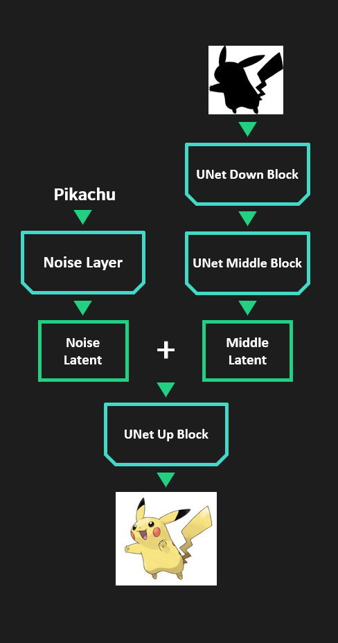
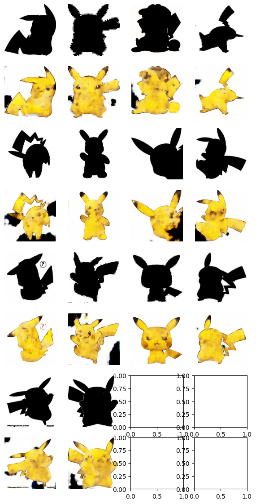
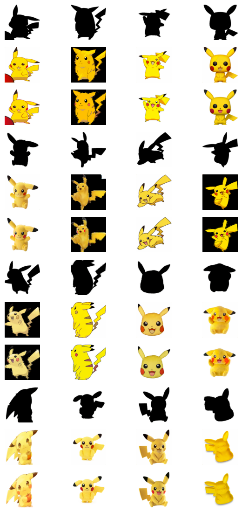

# Who’s that Pokémon?

📢 2023년 2학기 [AIKU](https://github.com/AIKU-Official) 활동으로 진행한 프로젝트입니다

## 소개

* 오늘의 포켓몬은 뭘까~요?
* 포켓몬의 실루엣과 그리고 싶은 포켓몬 정보만으로 알맞게 그림을 그려주는 생성모델을 만드는 것이 프로젝트의 목표입니다.

## 방법론

* UNet 기반의 생성기를 사용하였습니다.
* Middle Block을 통과한 latent에 포켓몬 정보 noise를 더해주어 학습될 수 있도록 유도하였습니다.

## 환경 설정
* python >= 3.10.0  
* pytorch >= 2.1.0+cu121  
* einops >= 0.7.0

## 사용 방법

## 예시 결과
* 학습 진행에 따른 test 실루엣에 대한 생성 결과  

* 최종 모델에 test (unseen) mask를 줬을 때 생성한 피카츄

* 최종 모델에 train mask를 줬을 때 생성한 피카츄
* mask-fake-real 순서
* 데이터 수가 적어 굉장한 오버피팅이 발생한 듯한데 무언가 잘못된 듯 함

## 팀원

- [황수인](https://github.com/suin00h): 팀장, 모델 구조 제안 및 구성, 훈련
- [박승현](https://github.com): 모델 구조 제안 및 구성, 평가지표 연구
- [박준하](https://github.com/joon999): 데이터셋 수집, 데이터로더 코드 작성
- [유예빈](https://github.com/yebiniii): 데이터셋 수집
