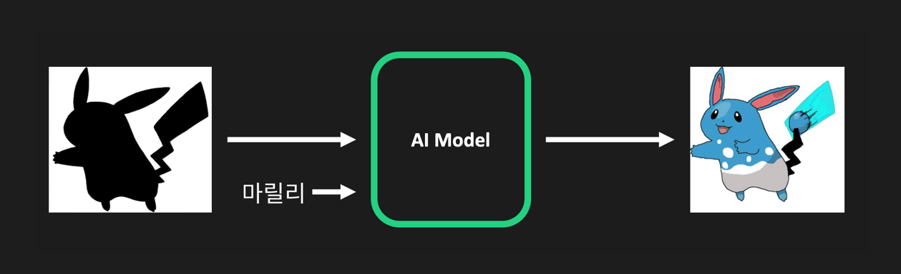

# Who’s that Pokémon?

📢 2023년 2학기 [AIKU](https://github.com/AIKU-Official) 활동으로 진행한 프로젝트입니다

## 소개

* 오늘의 포켓몬은 뭘까~요?
* 포켓몬의 실루엣과 그리고 싶은 포켓몬 정보만으로 알맞게 그림을 그려주는 생성모델을 만드는 것이 프로젝트의 목표입니다.

## 방법론

* UNet 기반의 생성기를 사용하였습니다.
* Middle Block을 통과한 latent에 포켓몬 정보 noise를 더해주어 학습될 수 있도록 유도하였습니다.

## 환경 설정

## 사용 방법

## 예시 결과

## 팀원

(프로젝트에 참여한 팀원의 이름과 깃헙 프로필 링크, 역할을 작성해주세요)

- [황수인](https://github.com/suin00h): 팀장, 모델 구조 제안 및 구성, 훈련
- [박승현](홍길동의 github link): (수행한 역할을 나열)
- [박준하](홍길동의 github link): (수행한 역할을 나열)
- [유예빈](https://github.com/yebiniii): 데이터셋 수집
